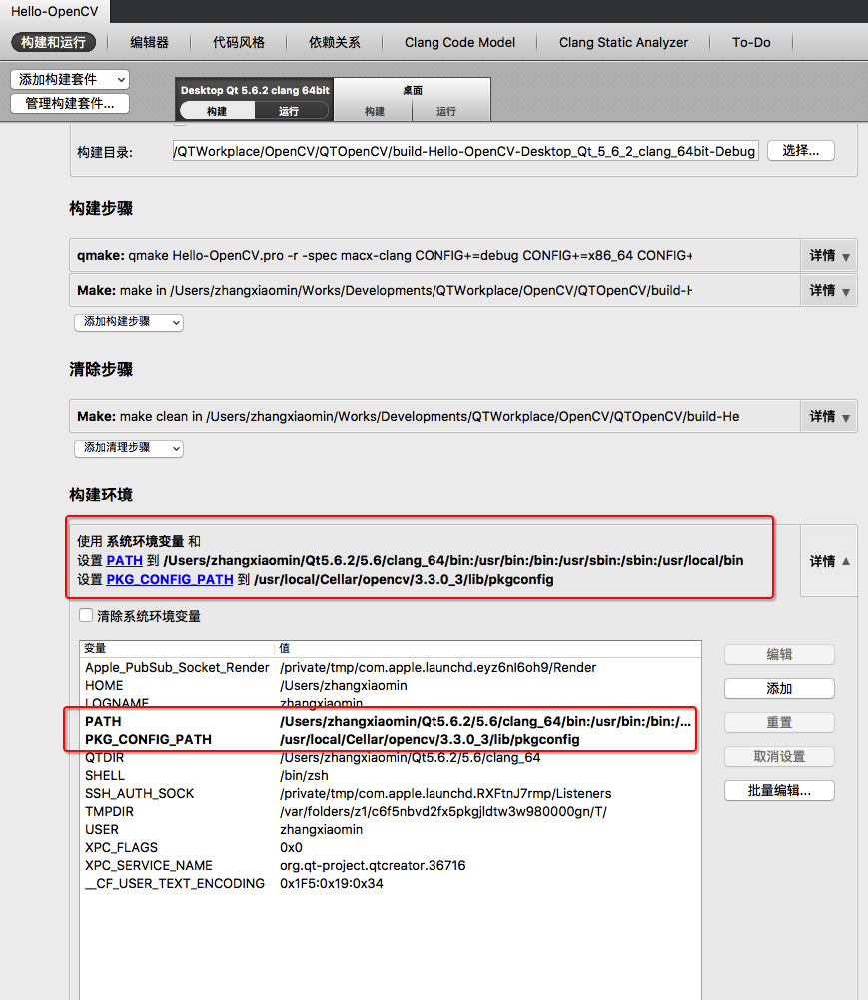
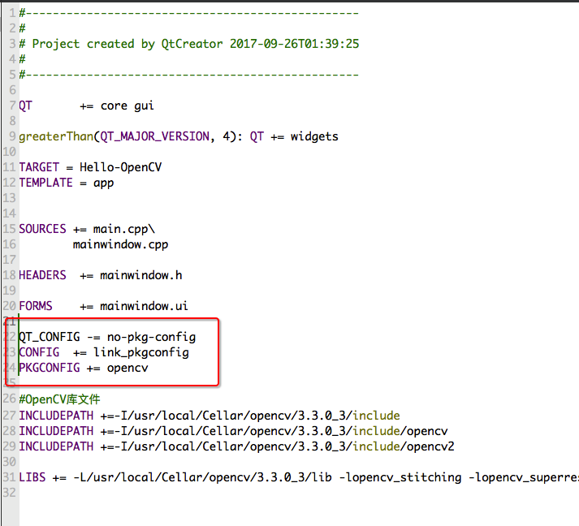
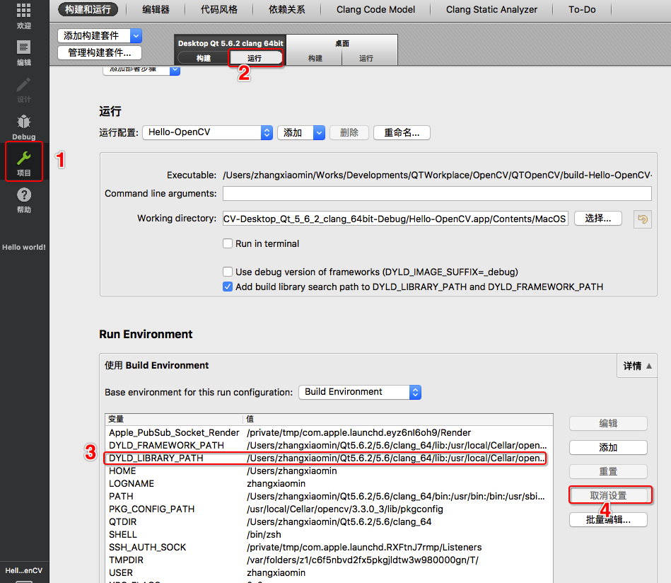

 
# Mac+QT5+OpenCV

[toc]

## Mac上OpenCV的安装
1. 首先检查OpenCV是否安装成功
```
brew info opencv
```
2. 安装OpenCV必须的依赖工具Cmake
```
brew install cmake
```
3. 安装OpenCV
- 安装OpenCV 2.4.X
```
brew tap homebrew/science
brew install opencv
```
- 安装OpenCV 3
```
brew tap homebrew/science
brew install opencv3
```
在mac上安装OpenCV3的详细教程，可以参阅:http://www.learnopencv.com/install-opencv-3-on-yosemite-osx-10-10-x/  
在Mac上使用OpenCV3有点小问题，因为OpenCV3包含了一样的一些库文件，所以OpenCV3不是通过/usr/local/lib来部署连接其体的库文件的。
## OpenCV在QT中的配置
1. 第一步，也是最重要的一步，找到pkg-config的存储位置。默认的pkg-config存储位置是：/usr/local/bin
```
which pkg-config
#returns /usr/local/bin/pkg-config
```
需要将/usr/local/bin添加到PATH中。打开**构建环境**,添加/usr/local/bin到PATH，不要忘记在之前添加":"。  

如果使用的是OpenCV3还需要添加一个新的环境变脸：PKG_CONFIG_PATH,并将该环境变量的值设置为包含opencv.pc的目录，使用如下命令，你可以找到文件所在的目录:
```
find /usr/local -name "opencv.pc"
#/usr/local/Cellar/opencv3/3.3.0_3/lib/pkgconfig/opencv.pc
```
2. 配置在QT的工程设置中
- 我们需要添加一行配置告诉QT的qmake使用opencv的pkg-config来进行编译：
```
# The following lines tells Qmake to use pkg-config for opencv
QT_CONFIG -= no-pkg-config
CONFIG  += link_pkgconfig
PKGCONFIG += opencv
```


如果使用的是OpenCV3,编译器可能会报出如下错误（我的配置没有遇到这种错误）:
```
ld: library not found for -lippicv
```
如果遇到这种错误，可以使用如下方法修复:  
编译器报出的ippicv库实际上就在OpenCV的安装目录下，但是没有连接正确，可以使用如下命令找到实际的安装位置：
```
find /usr/local/Cellar -name "libippicv*"
#/usr/local/Cellar/opencv3/3.3.0_3/share/OpenCV/3rdparty/lib/libippicv.a
```
可以将这个库添加到.pro文件中：
```
LIBS += -L/usr/local/Cellar/opencv3/3.3.0_3/share/OpenCV/3rdparty/lib
```
- 配置OpenCV的库文件
```
#OpenCV库文件
INCLUDEPATH +=-I/usr/local/Cellar/opencv/3.3.0_3/include
INCLUDEPATH +=-I/usr/local/Cellar/opencv/3.3.0_3/include/opencv
INCLUDEPATH +=-I/usr/local/Cellar/opencv/3.3.0_3/include/opencv2

LIBS += -L/usr/local/Cellar/opencv/3.3.0_3/lib -lopencv_stitching -lopencv_superres -lopencv_videostab -lopencv_photo -lopencv_aruco -lopencv_bgsegm -lopencv_bioinspired -lopencv_ccalib -lopencv_dpm -lopencv_face -lopencv_fuzzy -lopencv_img_hash -lopencv_line_descriptor -lopencv_optflow -lopencv_reg -lopencv_rgbd -lopencv_saliency -lopencv_stereo -lopencv_structured_light -lopencv_phase_unwrapping -lopencv_surface_matching -lopencv_tracking -lopencv_datasets -lopencv_text -lopencv_dnn -lopencv_plot -lopencv_ml -lopencv_xfeatures2d -lopencv_shape -lopencv_video -lopencv_ximgproc -lopencv_calib3d -lopencv_features2d -lopencv_highgui -lopencv_videoio -lopencv_flann -lopencv_xobjdetect -lopencv_imgcodecs -lopencv_objdetect -lopencv_xphoto -lopencv_imgproc -lopencv_core

```

3. 查看OpenCV库文件的路径  
可以使用如下命令来查看安装的OpenCV在Mac中环境变量
```
pkg-config --cflags --libs opencv
```
使用如下命令，可以查看当前安装的所有库
```
pkg-config --list-all
```
如我的电脑查看到的OpenCV库文件的路径如下
```
-I/usr/local/Cellar/opencv/3.3.0_3/include/opencv -I/usr/local/Cellar/opencv/3.3.0_3/include -L/usr/local/Cellar/opencv/3.3.0_3/lib -lopencv_stitching -lopencv_superres -lopencv_videostab -lopencv_photo -lopencv_aruco -lopencv_bgsegm -lopencv_bioinspired -lopencv_ccalib -lopencv_dpm -lopencv_face -lopencv_fuzzy -lopencv_img_hash -lopencv_line_descriptor -lopencv_optflow -lopencv_reg -lopencv_rgbd -lopencv_saliency -lopencv_stereo -lopencv_structured_light -lopencv_phase_unwrapping -lopencv_surface_matching -lopencv_tracking -lopencv_datasets -lopencv_text -lopencv_dnn -lopencv_plot -lopencv_ml -lopencv_xfeatures2d -lopencv_shape -lopencv_video -lopencv_ximgproc -lopencv_calib3d -lopencv_features2d -lopencv_highgui -lopencv_videoio -lopencv_flann -lopencv_xobjdetect -lopencv_imgcodecs -lopencv_objdetect -lopencv_xphoto -lopencv_imgproc -lopencv_core
```
4. 常见问题处理
- 如果出现如下错误：
```
dyld: Symbol not found: __cg_jpeg_resync_to_restart
  Referenced from: /System/Library/Frameworks/ImageIO.framework/Versions/A/ImageIO
  Expected in: /usr/local/lib/libJPEG.dylib
 in /System/Library/Frameworks/ImageIO.framework/Versions/A/ImageIO
The program has unexpectedly finished.
```
修复这个问题需要去到:项目->运行->Run Environment下取消DYLD_LIBRARY_PATH的设置：

## 版本说明
医学数字图像处理中常用的增强、卷积、模板匹配、仿射变换、重映射、分割等功能
- [x] 增强
- [x] 卷积
- [ ] 模板匹配
- [ ] 放射变换
- [ ] 重映射
- [ ] 分割